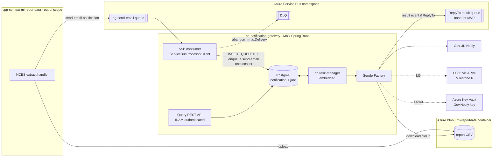

# Architecture & Design: cp-notification-gateway (notification-notify MbD rewrite)

> Pipeline **Stage 2 (Architecture & Design)**. Input artefacts (Stage 1 → Stage 2 handoff manifest):
> `docs/pipeline/requirements.md` and `docs/pipeline/legacy-result-event-contract.md`. Always-load
> context: `tech-stack.md`, `hmcts-standards.md`, `azure-cloud-native.md`, `logging-standards.md`
> (+ `azure-sdk-guide.md` on-demand). Pattern evidence cited inline from neighbouring CPP repos.
> **Human gate — not approved until the user confirms.** Clarifications Q1–Q6 were answered by the
> coordinator and are recorded in the Handoff Gap Report.

## Design: mi-reportdata email notification slice on a Modern-by-Default gateway

### Summary
`cp-notification-gateway` is a new **Modern-by-Default (MbD) Spring Boot service** that re-platforms the
legacy WildFly CQRS/event-sourced `cpp-context-notification-notify` onto direct-to-DB persistence, Azure
Service Bus (ASB) transport, cp-task-manager async, and Azure Blob attachments — **without changing
observable business behaviour** (NFR-001 golden-master parity). It consumes `send-email-notification`
commands from a shared ASB queue, sends via Gov.UK Notify (O365 in Milestone 6), tracks delivery, and
optionally publishes a terminal result event to the inbound message's `ReplyTo` queue. This design covers
Epics 1–3 (Milestones 1–7) with the mi-reportdata fire-and-forget email as first client.

### Pattern & Rationale
**Rubric bucket: MbD event-processor / integration service that is thin-stateful** (Postgres row +
co-located cp-task-manager `jobs`). This is mandated by the requirements (Goals; NFR-011) and is the
platform default (`tech-stack.md` §"Choosing a pattern": *"Default to Modern by Default. Only choose
CQRS/Event Sourcing when the domain genuinely requires event sourcing or when extending an existing
context service."*). The domain here is a **stateless-ish dispatch pipeline with a status row**, not a
rich aggregate needing replay/audit-by-event — so CQRS/ES is deliberately dropped.

- **Not a new CQRS context service** — no aggregate invariants beyond a single-row status machine; the
  legacy event-sourcing existed only to drive async tasks, a role cp-task-manager now fills. Keeping ES
  would violate "no new legacy WildFly/Java EE services" and add an event store for no domain benefit.
- **Not an extension of an existing `cpp-context-*`** — the legacy context is being *retired*, not
  extended; greenfield capability goes to MbD.
- Scaffolded from the HMCTS Spring Boot template (`service-hmcts-crime-springboot-template`) via the
  `springboot-service-from-template` skill (NFR-011, Hard rules) — build/Dockerfile/logback are **not**
  hand-rolled.

### Bounded Context & Data Ownership
- **Owning context:** `cp-notification-gateway` owns the `notification` table end-to-end (status,
  timestamps, error). cp-task-manager's `jobs` table is **co-located in the same datasource** (FR-002)
  so INSERT-row + enqueue-task commit in one local Postgres transaction (NFR-010).
- **No cross-context DB reads.** Integration with other contexts is exclusively via ASB messages and a
  cross-context **blob read** (Storage Blob Data Reader on mi-reportdata's container, FR-004/FR-014).
- **Cross-context touch points:**
  1. Inbound command from `cpp-context-mi-reportdata` (producer out of scope) → shared queue `ng-send-email`.
  2. Attachment bytes read from mi-reportdata's Azure Blob container by `fileUri` (cross-context RBAC).
  3. Outbound result event → the inbound message's `ReplyTo` queue (none for the mi-reportdata MVP —
     fire-and-forget).
- **Aggregate / invariants:** a single `notification` row keyed by `notificationId` (PK = idempotency
  key). Invariant: **exactly-once observable effect** under at-least-once delivery — one row, one send,
  at most one result event, enforced by (a) PK dedupe on ingest and (b) a state-transition guard on every
  terminal transition and result publish (FR-022, NFR-009).

### Components
| Repo / module | New / changed | Purpose | Pattern source (cited) |
|---|---|---|---|
| **`cp-notification-gateway`** (svc) | new | the service | template `service-hmcts-crime-springboot-template` |
| `…/consumer` | new | `ServiceBusProcessorClient` + listener, `disableAutoComplete`, complete/abandon | `cpp-mbd-idam-integration/src/main/java/uk/gov/hmcts/cp/idam/consumer/ServiceBusEventConsumer.java` (body read + complete/abandon), `…/config/ServiceBusConfig.java` |
| `…/command` | new | `SendEmailCommand` DTO (flat JSON, logical fields per requirements §Interface contracts) | (legacy) `notificationnotify.command.send-email-notification` |
| `…/persistence` | new | `Notification` JPA entity (incl. `client_context` for result-event parity and `result_queue` — the inbound ASB `ReplyTo`, both persisted on ingest), repository, `V1000__create_notification_table.sql` | `cp-court-list-publishing-service` (Flyway/JPA + real cp-task-manager consumer) |
| `…/tasks` | new | `SendEmailTask`, `CheckEmailStatusTask` implementing `ExecutableTask`, retry list via `getRetryDurationsInSecs()` | `cp-task-manager/.../service/task/ExecutableTask.java:76-95`; (legacy) `SendEmailTask`/`CheckEmailStatusTask` |
| `…/sender` | new | `SenderFactory` routing, `GovNotifySender`, `Office365Sender` (stub in M1, live M6) | (legacy) `…/sender/SenderFactory.java`, `EmailSender`, `MicrosoftOffice365ClientService` |
| `…/blob` | new | `AttachmentDownloader` (azure-storage-blob + Workload Identity), 403/404 → permanent-fail | `cpp-context-reference-data` (UC1 BYO filestore) |
| `…/result` | new | `ResultEventPublisher` → `ReplyTo` queue, ReplyTo-gated, state-guarded | `cpp-mbd-idam-integration` ASB sender; (legacy) `NotificationNotifyPublicEventProcessor` (golden-master build logic) |
| `…/query` | new | secured read REST controller (`GET /notifications/{id}`, `GET /notifications`) | `cp-court-list-publishing-service` REST/JPA; `cpp-mbd-idam-integration` auth |
| `…/observability` | new | Micrometer metrics + DLQ-depth gauge + dropped-monitor counter (FR-023) | `cpp-mbd-idam-integration`, `cp-court-list-publishing-service` |
| **`api-notification-gateway`** (new OpenAPI repo) | new | query-API OpenAPI spec (API-first, Q6) | `springboot-api-from-template` / `api-hmcts-crime-template` |
| `cpp-flux-config` | changed | Flux `HelmRelease` of `springboot-app` chart + values/identity/secretProvider | `cpp-mbd-idam-integration` deploy pattern |
| `cpp-helm-chart` | changed | `springboot-app` values; `ccm-namespace` MI (`mi.yaml`); ASB ASO CRDs (OQ-1) | `cpp-context-reference-data` UC1 identity |
| `cpp-aks-deploy` | changed | `ccm_workload_identities` + Key Vault CSI (or Platform out-of-band) | UC1 |

### Contracts

**Commands**
- `send-email-notification` — inbound, shared **command queue per command type** `ng-send-email`
  (FR-003; not per-client). A single shared queue serves all clients; there is **no per-originator
  routing** — the optional `clientContext` field is a passthrough for result-event parity, not a
  routing key.
- Logical payload = requirements §"Interface contracts (logical) → Inbound". Required
  `{notificationId, templateId, sendToAddress}`, `additionalProperties:false` (legacy-faithful).

**Events** (producer = this service; consumers = originating contexts; **none for the MVP** —
mi-reportdata sends no `ReplyTo`)
- `public.notificationnotify.events.notification-sent`
- `public.notificationnotify.events.notification-failed`
- Logical payloads = `legacy-result-event-contract.md` golden-master, byte-for-byte (NFR-001,
  `additionalProperties:false` — add no fields). `sent` = verbatim copy of internal payload; `failed`
  = hand-built, drops `failedTask`, omits absent optionals (`statusCode`/`clientContext`).
- **Schema-owning location (Q6):** the two JSON schemas live **in-repo** under `contracts/` in
  `cp-notification-gateway` (no external consumer exists for the MVP). **Evolution: additive-only**
  (optional fields only); a breaking change requires a new event name + ADR. When a real originator
  opts in, revisit promoting them to a shared CPP event-schema registry.

**APIs** (query REST; **OpenAPI**, MbD standard; companion repo `api-notification-gateway`, Q6)
- `GET /notifications/{notificationId}` → all columns of one row (AC-017).
- `GET /notifications?status=&createdFrom=&createdTo=&page=&size=` → paged search (Q5 default).
  `sendToAddress` filtering optional (PII — see cross-cutting). DB indexes on `status`, `created_at`.
- **Authenticated from day one (Q3)** — IDAM JWT via `cp-auth-rules-filter` (per `cpp-mbd-idam-integration`).
  Read-only, no write side effects (AC-018).

**Transport binding (physical — Stage 2's to own; Q1: Stage 2 authoritative, producer conforms)**

| Aspect | Inbound `send-email-notification` | Outbound `notification-sent` / `-failed` |
|---|---|---|
| ASB `subject` | `send-email-notification` (command name; consumer asserts) | event name (`public.notificationnotify.events.notification-{sent,failed}`) |
| Body | flat JSON = logical command fields (no framework `_metadata` wrapper) | flat JSON = golden-master payload (no wrapper) |
| Originator (`clientContext`) | optional **top-level body field**; **not** a routing key — persisted on the row and echoed into result events for parity (present-if-set) | echoed into payload if present |
| `ReplyTo` | native ASB `ReplyTo` message property → **captured at ingest into `notification.result_queue`** (the terminal event fires in a later task execution, so it is persisted, not threaded through `job_data`); gates + names the result queue (FR-007) | n/a (published *to* the persisted `result_queue`) |
| Correlation | `applicationProperties.correlationId` → MDC (NFR-007); missing → generate | propagate the same `correlationId` in `applicationProperties` |
| `userId` | n/a | `applicationProperties.userId` when present (legacy `sent` sets it; `failed` does not) |
| Serialisation | Jackson (`uk.gov.hmcts.cp.*`), UTF-8 JSON `getBody().toString()` per house pattern | Jackson JSON |

Rationale: mirrors the house MbD ASB pattern (`ServiceBusEventConsumer` reads `getBody()`/`getMessageId()`
only) and keeps the wire minimal; `ReplyTo`+`subject` are standard ASB properties so no bespoke
envelope is needed. Result-event **routing** (ReplyTo→queue) was already fixed by FR-007; only the
envelope mapping above is Stage 2's addition.

**Error taxonomy (physical — Stage 2's to own; parity port)**
Ported **verbatim** from legacy `cpp-context-notification-notify/.../task/processors/FailureSelector.java`
(NFR-001):
- **Permanent (fail fast, `markFailed()`, no infinite retry):** HTTP `400` (`SC_BAD_REQUEST`), HTTP
  `413` (`SC_REQUEST_ENTITY_TOO_LARGE`); **Azure Blob `403`/`404`** (FR-004/AC-010).
- **Transient (retry per `60,300,1800,3600,7200,14400`):** HTTP `500`; `statusCode==0` carrying the
  legacy PDF-download / document-download / `SSLHandshakeException` messages; and any non-permanent
  failure (legacy default `!isPermanentFailure`).
- O365: a successful APIM response = immediately `DELIVERED`, no poll (FR-019); its error mapping lands
  with Milestone 6.

### Diagrams

**Container diagram**


**Sequence — happy path (Gov.UK Notify, ≤2 MB, no ReplyTo)**
```mermaid
sequenceDiagram
  participant MI as mi-reportdata
  participant CQ as ASB ng-send-email
  participant CO as Consumer
  participant DB as Postgres (notification+jobs)
  participant TM as cp-task-manager
  participant BL as Azure Blob
  participant GN as Gov.UK Notify

  MI->>CQ: send-email-notification (subject, body, correlationId; no ReplyTo)
  CQ->>CO: deliver (disableAutoComplete)
  CO->>DB: PK dedupe; INSERT QUEUED + enqueue send-email (one tx)
  Note over CO,DB: existing id → silent no-op (AC-005)
  DB-->>CO: commit
  CO->>CQ: completeMessage() (ack after commit)
  TM->>BL: SendEmailTask: download fileUri
  alt blob 403/404
    BL-->>TM: error → markFailed (permanent, AC-010)
  else ok
    BL-->>TM: bytes
    TM->>GN: send (templateId + personalisation + attachment)
    GN-->>TM: reference id
    TM->>DB: schedule check-email-status (ref in job_data)
    TM->>GN: poll status
    GN-->>TM: DELIVERED
    TM->>DB: markSent() (state-guarded)
    Note over TM: no ReplyTo → no result event (AC-015)
  end
```

### Cross-cutting
- **AuthZ:** command path has **no REST surface** (AC-002). Query API **authenticated from day one**
  (Q3) — IDAM JWT via `cp-auth-rules-filter`; **FR-024 (secure query API) is pulled into the MVP and
  delivered alongside FR-009**, no longer deferred to Milestone 7. ASB + Blob + Key Vault access via
  **managed-identity RBAC only** (FR-013/014,
  NFR-002): ASB Data Receiver + Data Sender at **namespace** scope (queue scope would break dynamic
  `ReplyTo` routing — Constraints), Storage Blob Data Reader on attachment container(s), Key Vault
  Secrets User (read-only). No SAS/connection strings in prod (emulator-only local exception).
- **PII / data classification:** `send_to_address` (recipient email) is OFFICIAL-SENSITIVE (NFR-005).
  Never logged (NFR-004). Because the query API is authenticated (Q3), returning all columns is safe;
  `sendToAddress` search is optional and, if enabled, sits behind the same auth.
- **Audit/metrics (FR-023, NFR-007/008):** JSON logs to stdout via logstash-logback-encoder with
  `correlationId`+`requestId` MDC (template logback unmodified); Micrometer `/actuator/prometheus`;
  OpenTelemetry → Azure Monitor; **DLQ-depth gauge** on inbound + result queues; counter for dropped
  `NotificationMonitor` failures (legacy monitor events are dropped, not re-published).
- **Feature toggles:** none service-side for the MVP (producer-side `useServiceBus` is out of scope).
  `cjsm.net` routing domain and the 2 MB threshold are **config values** (FR-018), not runtime toggles.
- **Correlation:** `applicationProperties.correlationId` → MDC on consume; propagated onto the
  cp-task-manager `job_data` and onto any outbound result event's `applicationProperties`.
  Contrast with the result-routing target: `correlationId` is per-execution trace metadata that rightly
  rides `job_data` (missing → regenerate), whereas the ASB `ReplyTo` is **notification-scoped, has no
  regenerate fallback, and is read at the terminal hop** — so it is persisted on the row
  (`result_queue`), not carried in `job_data`.
- **Email-detail fields (result-event parity):** `emailSubject`/`emailBody`/`replyToAddress`/
  `sendToAddress` for the `notification-sent` event come from the provider **send response**, captured
  at send time and carried across the async hop in the `check-email-status` **message envelope**
  (`job_data`), then consumed by `markSent()` — mirroring legacy `ExtractedSendEmailResponse` →
  `ExternalIdentifier` job state → `CompleteHandler.markAsSent(...)` → `Notification.notificationSent()`.
  Like `correlationId` they ride the envelope (a lost optional degrades to absent); unlike `result_queue`
  they are **not** persisted on the row and **not** re-read from Gov.Notify at poll.
- **Dual-write atomicity (Q-delegated #4):** the ingest path is **atomic** — the `notification`
  INSERT and the cp-task-manager task enqueue commit in **one local transaction** on the co-located
  datasource (FR-002/NFR-010), and ASB redelivery + `notificationId` PK dedupe cover a crash between DB
  commit and message ack. So there is **no dual-write gap at ingest and no reconciliation sweep is
  needed** (FR-021 removed) — neither a sweep nor a transactional outbox is warranted. The one genuine
  residual is upstream: **cp-task-manager has no stale-lock recovery** — a hard crash while a job is
  *locked and executing* strands it (`worker_id` never cleared). Tracked as **OQ-4** →
  `cp-task-manager-stale-lock-gap.md` (fix belongs in the library, not this service).
- **Idempotent send (FR-022):** the `send-email` task begins with a **recover-by-reference** check — it
  queries Gov.UK Notify by client `reference` (= `notificationId`) *before* sending, skips the send if a
  matching notification already exists, then proceeds to check-status. This closes the duplicate-send
  window a crash-after-send / task re-run would otherwise open (legacy has **no** such guard — it
  re-sends). With the state-transition guard (NFR-009), redeliveries and re-runs yield at-most-one email
  and at-most-one result event.

### Deployment
- **Helm:** shared `springboot-app` chart in `cpp-helm-chart`; values set `SERVER_PORT`, ASB namespace
  FQDN, Blob endpoint/container, DB, resource requests/limits, liveness/readiness (actuator groups),
  ASB tuning (max-delivery-count, lock duration, prefetch, concurrency) — per `azure-sdk-guide.md`
  (tuned in Helm, not code). Per-context managed identity via `ccm-namespace`/`mi.yaml`.
- **Flux:** `HelmRelease` + values/identity/secretProvider (Key Vault CSI) in `cpp-flux-config`;
  **no Helmsman/`cpp-aks-deploy` ADO path** (FR-017/AC-026). Pattern ← `cpp-mbd-idam-integration`.
- **Provisioning (OQ-1 — two paths, Platform to choose):** (a) ASB namespace/queues + role assignments
  via `cpp-helm-chart` ASO CRDs (`servicebus.azure.com`, `authorization.azure.com`) **if** the cluster's
  ASO version serves them at a stable API version; else (b) Platform out-of-band request (matching the
  Flux/idam model). Design does not depend on which — both yield namespace-scoped RBAC.
- **CI:** **GitHub Actions** (template-shipped) — `ci-draft.yml`→`ci-build-publish.yml` (build+unit+IT),
  `code-analysis.yml` (PMD), `secrets-scanner.yml`, `codeql.yml`; release via `ci-released.yml`. **Not
  Azure DevOps** (FR-011). Pattern ← `cpp-mbd-idam-integration`.
- **Rollout:** dev/local (emulator + Testcontainers) → STE (Milestones 4–5, simulators/stubs, real RBAC)
  → live. No data migration ordering (greenfield table); Flyway creates `notification` (V1000) and
  cp-task-manager auto-merges `jobs` (V1) into one Flyway run (FR-002/AC-001a).

### Risks & Trade-offs
1. **Inbound envelope is fixed by Stage 2 but the producer is a separate team/repo (Q1).** If
   mi-reportdata later emits a framework `_metadata` wrapper or puts the originator elsewhere, ingest
   breaks. *Mitigation:* publish the binding table above as the frozen contract in `contracts/`;
   contract-test the consumer against a synthetic message; the producer conforms. Blast: medium (ingest
   fails loudly, DLQ catches it, no data loss).
2. **NCES CSV may exceed 2 MB while O365 is Milestone 6 (Q2).** Coordinator confirmed **not a go-live
   blocker** (mi-reportdata does not consume until the MVP is fully implemented). *Mitigation:* build
   the `SenderFactory` >2 MB→O365 seam in Milestone 1 (stubbed), deliver O365 in Milestone 6 before
   real traffic. Blast: low given the sequencing.
3. **Golden-master parity drift (NFR-001).** `sent` needs `emailSubject`/`emailBody`/`replyToAddress`
   sourced from the Gov.Notify send response (not on our command); `failed` must drop `failedTask` and
   omit absent optionals; `additionalProperties:false`. *Mitigation:* golden-master diff test (FR-008)
   against the two schemas in `legacy-result-event-contract.md`; MVP exercises publish only via a
   synthetic `ReplyTo` message. Blast: medium (a spurious field silently breaks a future consumer).
- **Reversibility:** high for internal choices (envelope, schema location are config / in-repo). One-way-ish doors: **retiring the legacy service** and **ASB namespace-scoped RBAC model**
  (queue-scope would force a redesign of `ReplyTo` routing) — both already mandated by requirements, so
  no new lock-in introduced here.

### Alternatives Considered
- **Keep CQRS/Event-Sourcing (rebuild as `cpp-context-*`)** — rejected: violates "no new legacy
  WildFly/Java EE"; event store adds no domain value for a single-row status machine; cp-task-manager
  already provides the async engine the legacy events existed to drive.
- **Transactional outbox / reconciliation sweep for dual-write** — both rejected: the jobs table is
  co-located, so INSERT+enqueue is already one local transaction and there is no ingest dual-write gap
  to cover. The only residual (orphaned *locked* jobs after a hard crash) is a cp-task-manager library
  gap (OQ-4), not something an app-level outbox or sweep should paper over.
- **Per-client inbound queues** — rejected: Constraints mandate a shared queue per command type (no
  per-originator routing; `clientContext` is only a parity passthrough); per-client queues would
  multiply infra and break the "opt-in by ReplyTo" model for future originators.
- **Result-event schemas in a shared registry repo now** — deferred (Q6): no live consumer for the MVP;
  in-repo `contracts/` with additive-only evolution is lighter and re-promotable later.

### Implementation Outline
- [ ] Scaffold `cp-notification-gateway` via `springboot-service-from-template` (Spring Boot 4.x, Java
      25, Gradle, actuator; deps: ASB SDK, Blob SDK, azure-identity, cp-task-manager, Flyway, Postgres,
      Gov.Notify client) — FR-001.
- [ ] Add `V1000__create_notification_table.sql`; verify cp-task-manager `jobs` auto-merge — FR-002.
- [ ] Consumer: `ServiceBusProcessorClient` + `disableAutoComplete`, PK dedupe, INSERT+enqueue in one
      tx, `completeMessage()` after commit, `abandon` on failure → DLQ — FR-003.
- [ ] `AttachmentDownloader` (blob + Workload Identity; 403/404 → permanent fail) — FR-004.
- [ ] `SendEmailTask`/`CheckEmailStatusTask` (`ExecutableTask`, `getRetryDurationsInSecs`=
      `60,300,1800,3600,7200,14400`); Gov.Notify send + poll → `markSent()` — FR-005/006.
- [ ] `SenderFactory` seam (Gov.Notify live; O365 stub) — FR-018 (stub) → FR-018/019 live in M6.
- [ ] `ResultEventPublisher` (ReplyTo-gated, state-guarded); `contracts/` JSON schemas +
      golden-master parity test — FR-007/008.
- [ ] Query REST API + OpenAPI in `api-notification-gateway`; IDAM auth from day one — FR-009 + Q3.
- [ ] Failure handling (`markAttempted`/`markFailed`, task COMPLETED on exhaustion), at-least-once
      guards, **idempotent send via Gov.Notify recover-by-reference at the start of the send path** —
      FR-020/022.
- [ ] Observability: metrics, DLQ-depth gauge, dropped-monitor counter — FR-023.
- [ ] Integration harness (Testcontainers + ASB emulator + Azurite + WireMock + Awaitility) — FR-010.
- [ ] GitHub Actions CI workflows — FR-011.
- [ ] STE simulators/stubs; Flux `HelmRelease`; MI + RBAC; ASB/DB provisioning — FR-012–017.

### Follow-ups
- **C4 model:** add container `cp-notification-gateway` to `cp-c4-architecture` with relations:
  `mi-reportdata → ng-send-email (ASB)`, `gateway → Gov.UK Notify`, `gateway → O365/APIM`,
  `gateway → Azure Blob (mi-reportdata container, cross-context read)`, `gateway → ReplyTo queue`,
  `gateway → Postgres`, and the retirement of `cpp-context-notification-notify`.
- **ADRs recommended:**
  1. *"Direct-to-DB + cp-task-manager replaces CQRS/Event-Sourcing for notification-notify"* (records
     the pattern departure from the legacy context).
  2. *"Idempotent send via Gov.UK Notify recover-by-reference"* (FR-022) — how duplicate sends are
     prevented without a sweep/outbox.
- **OQ-4 — cp-task-manager stale-lock recovery gap:** upstream library gap (no reaper for jobs whose
  worker crashed mid-execution). See `cp-task-manager-stale-lock-gap.md`; raise a cp-task-manager ticket.
- **New repo:** `api-notification-gateway` (OpenAPI, API-first) — via `springboot-api-from-template`.
- **Design artifact:** `docs/pipeline/artifacts/001-notification-gateway-blueprint.html`
  (architecture blueprint, template 08) — surfaced at the Stage 2 human gate.

### Handoff Gap Report
| # | Tag | Decision | Inputs said | Resolution | Blast if wrong |
|---|-----|----------|-------------|------------|----------------|
| 1 | AMBIGUOUS→resolved (Q1) | Inbound ASB envelope | Manifest delegated envelope to Stage 2; producer-side out of scope, envelope not frozen | Coordinator: **Stage 2 authoritative, producer conforms** — flat body, `subject`=command name, originator top-level body field, `correlationId` in appProps, native `ReplyTo`. Frozen in `contracts/`. | Medium — ingest fails loudly to DLQ if producer diverges; no silent data loss. |
| 2 | AMBIGUOUS→resolved (Q2) | NCES size vs 2 MB / O365 timing | Milestone 6 note asked to confirm typical NCES size | Coordinator: **milestone order unchanged, not a go-live blocker**; build SenderFactory seam in M1, deliver O365 in M6. | Low — sequencing confirmed; carried as Risk 2. |
| 3 | AMBIGUOUS→resolved (Q3) | Query-API auth in MVP vs deferred | FR-009 MVP unauthenticated returning PII; FR-024 (M7) adds auth — tension with NFR-005 | Coordinator: **pull FR-024 auth INTO the MVP** (IDAM JWT); no unauthenticated PII endpoint ships. | Low once applied — removes the security tension. |
| 4 | MISSING → routes to Stage 1 / product / DPO | Data-retention period (NFR-014, UK-GDPR) — **stage-gating by default** | NFR-014/Constraints require a defined+enforced retention period; **no value given**, no FR enforces it | Coordinator: **defer enforcement, record the gap** — schema supports future purge (indexed `created_at`), no `@Scheduled` purge in these epics. **Route to product/DPO to set the period.** | High if never set — UK-GDPR non-compliance / unbounded OFFICIAL-SENSITIVE retention. **Must be resolved before go-live**; amend `requirements.md` NFR-014 with the agreed period. |
| 5 | ASSUMED (Q5, accepted) | Query search shape | FR-009 "lookup and search", fields/paging unspecified | Default accepted: by-id + `status`/`createdFrom`/`createdTo` + page/size; index `status`,`created_at`; `sendToAddress` optional | Low — additive to the OpenAPI contract. |
| 6 | ASSUMED (Q6, accepted) | Contract-artefact homes | Event schema repo + query api- repo left to implementation | Default accepted: events in-repo `contracts/` (additive-only); companion `api-notification-gateway` OpenAPI repo | Low — re-promotable to a shared registry later. |
| 7 | WOULD-HAVE-USED-PRIOR-ARTEFACT / not-available-locally | ASB sender + Flux/Helm/RBAC specifics | Requirements cite `service-cp-crime-hearing-results-document-subscription`, `cpp-flux-config`, `cpp-helm-chart`, `cpp-aks-deploy` as pattern sources | **Not checked out locally** — deployment specifics SAFE-DEFAULTed from `cpp-mbd-idam-integration` + `cpp-context-reference-data` (UC1) + `azure-sdk-guide.md`. Verify against the real repos at implementation. | Medium — exact Helm/Flux keys and the ASB sender idioms need confirming before deploy. |
| 8 | INHERITED-OPEN (Platform-owned) | OQ-1 ASO for ASB CRDs; OQ-2 ACR/App-Insights identity; OQ-3 `sadevcommonscsl` | Requirements Open questions 1–3, owner Platform, due TBD | Not resolved here — **both provisioning paths presented** (ASO CRDs vs Platform out-of-band); OQ-2/OQ-3 carried as assumptions. | Medium — OQ-1 decides the provisioning mechanism (not the RBAC model); OQ-2/OQ-3 low. |
| 9 | INHERITED-OPEN → upstream (OQ-4) | cp-task-manager has no stale-lock/crash recovery for in-flight (locked) jobs | Confirmed **regression from the legacy jobstore**: cp-task-manager picks only `worker_id IS NULL` (`JobsRepository.java:63-81`) and `worker_lock_time` is written but never read; legacy reclaimed via a **1-hour lease** `worker_id IS NULL OR worker_lock_time < now−1h` (`cp-framework-libraries` `JobJdbcRepository.java:44-54,133-155`) | Documented in `cp-task-manager-stale-lock-gap.md`; fix = restore the dropped clause (configurable lease) in cp-task-manager. The removed reconciliation sweep would not have caught it (the stranded job **has** a locked task row). | Medium — a hard crash mid-task strands a notification non-terminal until the library restores the reclaim. |

### Handoff to User Story (Stage 3)
Inputs the story stage MUST read (explicit paths):
- `docs/pipeline/architecture-design.md` (this file) — pattern, components, contracts, transport
  binding, error taxonomy, cross-cutting, deployment.
- `docs/pipeline/requirements.md` — FR-001…FR-024, ACs, NFRs (the governing artefact).
- `docs/pipeline/legacy-result-event-contract.md` — result-event golden-master (FR-007/008 parity).
- `docs/pipeline/cp-task-manager-stale-lock-gap.md` — OQ-4 upstream gap (a story should raise the cp-task-manager ticket).
- `docs/pipeline/artifacts/001-notification-gateway-blueprint.html` — Stage 2 design artifact.

**Carry-forwards for Stage 3 to honour:**
- **Stage-gating (the only one) — Gap #4, data retention (UK-GDPR):** no retention period is defined;
  must be resolved with product/DPO and `requirements.md` NFR-014 amended (gap back-channel) before
  go-live. A story should capture it.
- **Resolved decisions (not gating), Stage 3 just honours them:**
  - Auth ships in the MVP (Q3): **FR-024** (secure query API with IDAM) is pulled forward and delivered
    **alongside FR-009** — the read API is never exposed unauthenticated. Not an open item.
  - Two ADRs recommended above; `api-notification-gateway` repo to be created; OQ-4 cp-task-manager
    ticket to be raised.

Then **halt for the Stage 2 human gate** — next stage is story-writer (Stage 3).
